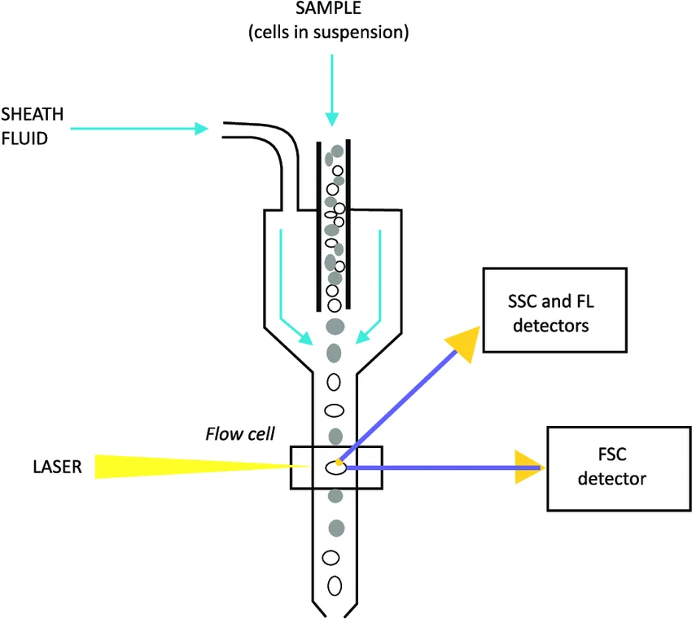
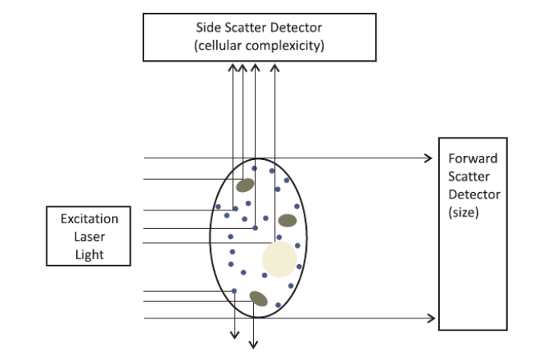
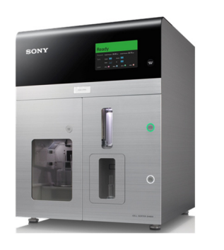

# Проточная цитометрия
## Историческая справка
Задачи, связанные с идентификацией клеток, их подсчётом и 
характеристикой, вызвали особый интерес у учёных во время 
Второй мировой войны В Соединенных Штатах. На поле боя требовались 
устройства, которые позволят детектировать бактериальное биологическое 
оружие, распылённое в воздухе. Данное приспособление использовало поток 
воздуха для фокусирования малых объектов (размера порядка 0.5 мкм) в тонкую трубку 
такого диаметра, что в нем помещалась за раз только одна частица. 
Далее эти частицы освещались лазером, свет которого рассеивался и попадал 
на фотодетекторы. Они, в свою очередь, генерировали электрический сигнал.

Такой прибор позволял детектировать споры _Bacillus_, по сути являясь 
первым цитометром. Впоследствии появились приборы, детектирующие изменения электрического 
импеданса клеток и флюоресцентного сигнала. Их применение стало особенно 
актуальным в клиниках для анализа состава крови и определения типа 
злокачественных опухолей.

## Устройство проточного цитометра
Схема проточного цитометра показана на _Рис.1_. Типичный проточный цитометр 
состоит из:
- жидкостной системы - направленного потока жидкости, окружающего взвешенные в нём клетки
для анализа. В таком виде они доставляются до лазерного луча. Скорость потока регулируется
цитометром. Поток жидкости позволяет отедлить клетки друг от друга и сфокусировать их
под лазером;
- оптической системы;
- электроники, конвертирующей оптический сигнал в электрические импульсы, анализируемые компьютером;
- системы анализа данных, собирающей статистику.

Отличают два вида цитометров: 
- анализирующие;
- сортирующие, которые помогают не только собирать данные о клетках, 
- но и сортировать их по заданному пользователем параметру.
- 

<figcaption align="center">Рис.1 Проточная цитометрия. 
Первые приборы использовали потоки воздуха.
Источник 
[The principle of the flow cytometry technique and its applicability]
</figcaption>

Как правило в качестве лазера используется аргоновый лазер с длиной волны 488 нм, хотя  в некоторых приборах
имеет место диодный лазер с длиной волны 635 нм. Лазерный пучок фокусируется с помощью системы линз на 
клетках и рассеивается на них. Отличают два вида рассеивания света на клетках:
- прямое рассеивание. Позволяет узнать информацию о размере клеток.
- боковое рассеивание. Позволяет узнать инфорацию о внутренней структуре клеток.

<figcaption align="center">Рис.2 Рассеяние света позволяет проводить анализ
клеток, проходящих через тонкую трубку цитометра и облученных лазером.
[The principle of the flow cytometry technique and its applicability]
</figcaption>

## Проточная цитометрия и флюореценция созданы друг для друга
Измерения интенсивности флюоресценции клеток осложнены явлением 
**фотообесцвечивания (photobleaching)**.

> Фотообесцвечивание - фотохимическое разрушение флюорофора 
> (фрагмента молекулы, излучающего свет). Происходит со временем 
> при облучении светом, вызывающим флюоресценцию.

Это означает, что измеряя в флюоресцентном микроскопе одни и те же 
клетки излучают свет разной интенсивности с течением времени, вызывая 
большую погрешность измерения.

Проточная цитометрия позволяет возбуждать световым пучком отдельные
флюоресцентные клетки светом на короткий промежуток времени 
(порядка нескольких микросекунд). При этом клетки протекают с относительно 
постоянно скоростью, что делает измерения интенсивности **высокоточными**.
Кроме того, проточная цитометрия позволяет проводить измерения нескольких
параметров одновременно.

### Выбор флюорофора
Важно выбирать флюорофор таким образом, чтобы его энергия возбуждения приходилась
на энергию, испускаемую лазером. Если в цитометре установлен лазер с длиной волны 488 нм, 
то длина волны возбуждения флюорофора дожна быть примерно равна 488 нм. При этом рассеиваемый
клетками свет будет иметь другую длину волны, больше, чем длина волны излучения лазера.

При использовании нескольких флюорофоров важно подобрать их таким образом, чтобы рассеиваемое 
клетками излучение было достаточно различимым. Хотя существует возможность различать почти накладывающиеся 
пики интенсивностей, если форма спектра у флюорофоров отличается [Spectral Cytometry Has Unique Properties 
Allowing Multicolor Analysis of Cell Suspensions Isolated from Solid Tissues]

## Цитометрия сегодня

Сегодня с помощью цитометров можно быстро получить большое количество данных
о клетках, содержащие информацию об их. К примеру:
- структурные параметры (размер, форма, гранулярность и т.д.);
- функциональные параметры (содержание ДНК, 
последовательность нуклеотидов, проводимость мембраны, 
активность ферментов, содержание белков и ионов и многие другие).

### В клиниках
В клиниках цитометрия применяется для детектирования остаточных очагов опухоли, которые
по морфологическим признакам неотличимы. 

<figcaption align="center"> Сортирующий цитометр Sony SH800S
</figcaption>